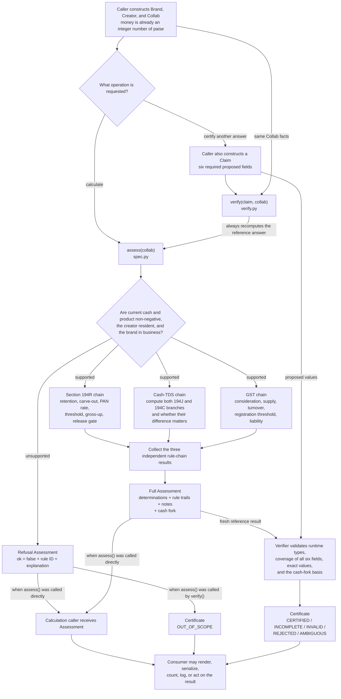
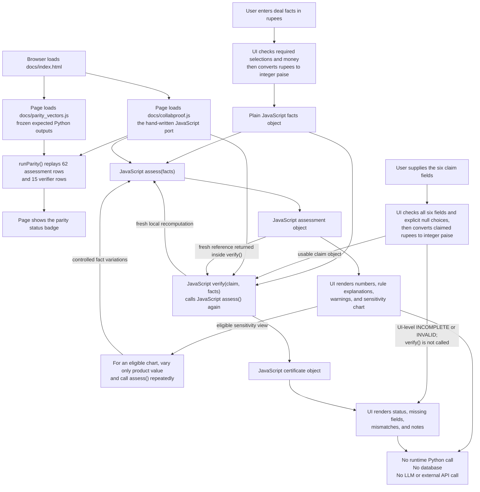
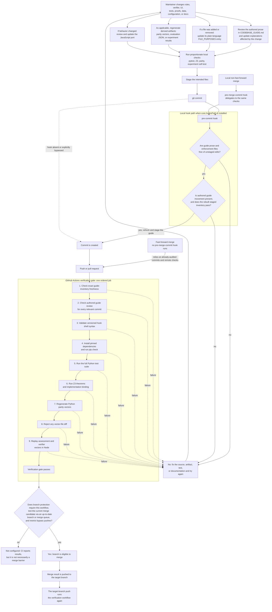

# collabproof: a complete, plain-language codebase guide

This is the long-form reading guide for the entire repository. It assumes that
you understand high-school or college mathematics, ordinary programming, JSON,
and basic ideas such as functions and tests. It does **not** assume prior
knowledge of Pramaana, Indian tax vocabulary, formal methods, theorem provers,
SMT solvers, or verification systems.

The shortest accurate description of the project is:

> collabproof is a small, deterministic program that encodes one interpretation
> of selected FY 2024–25 Indian tax rules for brand–creator collaborations. It
> calculates an answer from supplied facts, checks someone else's structured
> answer against that calculation, and either certifies the match, identifies a
> problem, or refuses a fact pattern outside its deliberately narrow scope.

The repository is an independent, Pramaana-inspired exploration. It is not a
Pramaana product, does not call Pramaana software, and is not affiliated with
Pramaana Labs. It is educational software, not legal or tax advice.

## How to use this guide

For a first reading, use this order:

1. Read the architecture and runtime-flow diagrams in Section 1.
2. Read the vocabulary primers.
3. Follow one deal through `assess()` and `verify()`.
4. Read the trust model: what is actually proved, tested, or merely assumed.
5. Use the file-by-file reference when opening the code.
6. Use the maintenance recipes before changing anything.

If you need only a public overview and results, read [`README.md`](README.md).
If you are rebuilding the front end, also read
[`REPO_STRUCTURE.md`](REPO_STRUCTURE.md). This guide is deliberately more
foundational and more exhaustive than either of those.

## 1. Architecture and system design: the system in pictures

This section gives four views of the same repository. They are deliberately
separate because one giant diagram would hide the most important distinctions:

1. the **architecture map** shows which components exist and depend on one
   another;
2. the **Python runtime flow** shows what happens to one set of facts;
3. the **browser runtime flow** shows the separate, entirely local JavaScript
   path; and
4. the **change and assurance flow** shows how source, tests, generated files,
   documentation, commits, and branch merges stay aligned.

A **component** is simply a part of the system with one job. A **runtime** is
the period while a program is actually executing. An **artifact** is a file
produced or consumed by a program, such as a JSON report or parity-vector file.
An arrow below means “calls,” “reads,” “writes,” or “is checked against”; the
text on the arrow says which meaning applies. Solid arrows show the ordinary
path. Dashed arrows show an indirect relationship, alternate path, or failure
path rather than the main successful execution.

### 1.1 Whole-repository architecture

This is the static map: where responsibilities live, rather than the precise
order in which one request executes. A box may represent several closely
related files; Section 18 later explains every committed file individually.

```mermaid
flowchart TB
    subgraph EXTERNAL["People and optional external service"]
        PYCLIENT["Python caller<br/>application, script, test, or notebook"]
        WEBUSER["Browser user"]
        MAINTAINER["Maintainer or reviewer"]
        MODELAPI["Optional Anthropic API<br/>used only when explicitly requested"]
    end

    subgraph PRODUCT["Product logic and entry points"]
        subgraph PYTHON["Authoritative Python package: collabproof/"]
            PUBLIC["Public import surface<br/>__init__.py"]
            SPEC["Facts, rules, and assessor<br/>spec.py"]
            VERIFY["Claim schema and certifier<br/>verify.py"]
            BASELINE["Intentionally wrong answerer<br/>baseline.py"]
            LLMBOUNDARY["Optional strict LLM boundary<br/>llm_adapter.py"]
        end

        subgraph BROWSER["Static browser application: docs/"]
            PAGE["Form, explanations, results, chart<br/>index.html"]
            JSPORT["Hand-written JavaScript engine<br/>collabproof.js"]
        end
    end

    subgraph RESEARCH["Evaluation and research runners"]
        EVAL["50-case answerer evaluation<br/>run_eval.py"]
        EVALDATA["Evaluation snapshots<br/>eval/cases.json<br/>eval/results.json"]
        EXPERIMENT["Bare / grounded / verified experiment<br/>experiments/three_arms.py"]
        CORPUS["Paraphrased legal-material corpus<br/>experiments/corpus/"]
        EXPDATA["Experiment result snapshots<br/>results_selftest.json and optional live results.json"]
    end

    subgraph ASSURANCE["Tests, proofs, and cross-language checks"]
        TESTS["Golden, adversarial, property,<br/>LLM-boundary, and docs-process tests<br/>tests/"]
        Z3PROOF["Narrow Z3 arithmetic model<br/>proofs/prove_cliff.py"]
        VECTORGEN["Python expectation generator<br/>gen_parity_vectors.py"]
        VECTORS["Frozen Python expectations<br/>docs/parity_vectors.js"]
        NODECHECK["Node parity runner<br/>docs/parity_check_node.js"]
    end

    subgraph MAINTENANCE["Repository and documentation maintenance"]
        GUIDE["Human explanation + generated inventory<br/>CODEBASE_GUIDE.md"]
        GUIDEGEN["Inventory and review enforcer<br/>tools/update_codebase_guide.py"]
        HOOKS["Local commit and merge hooks<br/>.githooks/"]
        CI["Verification workflow<br/>.github/workflows/ci.yml"]
        CONFIG["Package, dependency, license, and Git policy<br/>pyproject.toml, requirements-dev.txt,<br/>LICENSE, .gitignore"]
        SHORTDOCS["Shorter human entry points<br/>README.md, REPO_STRUCTURE.md"]
    end

    PYCLIENT -->|"imports"| PUBLIC
    WEBUSER -->|"uses"| PAGE
    MAINTAINER -->|"edits and reviews"| GUIDE

    PUBLIC -->|"re-exports"| SPEC
    PUBLIC -->|"re-exports"| VERIFY
    PUBLIC -->|"re-exports"| BASELINE
    VERIFY -->|"recomputes by calling assess()"| SPEC
    BASELINE -->|"produces a Claim later passed to"| VERIFY
    LLMBOUNDARY -->|"passes only a validated in-scope Claim to"| VERIFY

    PAGE -->|"passes facts and claims"| JSPORT
    JSPORT -->|"returns assessments and certificates"| PAGE
    SPEC -.->|"behavior copied manually"| JSPORT
    VERIFY -.->|"behavior copied manually"| JSPORT

    EVAL -->|"imports and calls"| PUBLIC
    EVAL -->|"optionally uses"| LLMBOUNDARY
    EVAL -->|"writes"| EVALDATA
    EXPERIMENT -->|"imports and calls"| PUBLIC
    EXPERIMENT -->|"uses strict parsing"| LLMBOUNDARY
    CORPUS -->|"grounds one experiment arm"| EXPERIMENT
    EXPERIMENT -->|"writes"| EXPDATA
    LLMBOUNDARY -->|"network call only with a key"| MODELAPI
    EXPERIMENT -->|"network call only in real LLM mode"| MODELAPI

    TESTS -->|"exercise"| PUBLIC
    TESTS -->|"exercise the strict model boundary"| LLMBOUNDARY
    TESTS -->|"exercise"| EVAL
    TESTS -->|"exercise"| EXPERIMENT
    TESTS -->|"integration-test"| GUIDEGEN
    Z3PROOF -->|"separately models narrow theorems<br/>and calls assess() for a bounded binding check"| SPEC
    VECTORGEN -->|"executes"| SPEC
    VECTORGEN -->|"executes"| VERIFY
    VECTORGEN -->|"writes"| VECTORS
    VECTORS -->|"passed as expectations to runParity() in"| JSPORT
    NODECHECK -->|"replays"| VECTORS
    NODECHECK -->|"executes"| JSPORT

    GUIDEGEN -->|"rewrites only the generated inventory"| GUIDE
    HOOKS -->|"run before a local commit or merge commit"| GUIDEGEN
    CI -->|"checks authored review and inventory"| GUIDEGEN
    CI -->|"runs"| TESTS
    CI -->|"runs"| Z3PROOF
    CI -->|"regenerates and diffs"| VECTORGEN
    CI -->|"runs"| NODECHECK
    CONFIG -->|"pyproject and requirements define the CI environment"| CI
    SHORTDOCS -->|"README links it; REPO_STRUCTURE complements it"| GUIDE
```

The most important architectural boundaries are:

- **Python is the source of truth.** Here, “source of truth” means the version
  maintainers intend other implementations to match. It does not mean the
  encoded legal interpretation is infallible.
- **The browser is a separate implementation.** `docs/index.html` does not call
  a Python server. It calls `docs/collabproof.js` in the browser process.
- **The verifier is downstream of an independent answer.** A human, naive
  baseline, or optional LLM proposes a `Claim`; it does not get to declare its
  own answer certified.
- **Not every LLM response reaches the verifier.** The model boundary first
  parses and validates the exact response shape. Invalid output, abstention,
  and an explicit refusal are classified outside `verify()`; only a validated
  in-scope claim is passed into the claim checker.
- **Z3 is an assurance artifact, not the runtime engine.** Ordinary assessment
  and verification do not invoke the solver.
- **Tests, parity, and documentation automation surround the product code.**
  They detect particular kinds of drift; none of them independently validates
  the underlying legal interpretation.

The architectural layers can also be read as this compact contract table:

| Layer | Receives | Returns or writes | Why it exists |
|---|---|---|---|
| Python assessor | A `Collab` fact object | An `Assessment` or explicit refusal | Calculates the encoded treatment deterministically |
| Python verifier | The same `Collab` plus a six-field `Claim` | A `Certificate` with a status and diagnostics | Separates “someone proposed an answer” from “the encoded rules accept it” |
| Answerers | Facts, and sometimes legal text | A proposed claim, refusal, or invalid response | Supplies realistic material for the verifier to judge |
| Browser app | Human-entered form values | A locally rendered assessment, certificate, and chart | Makes the prototype usable without a backend |
| Evaluation and experiments | Fixed cases plus answerers | JSON reports and aggregate counts | Measures answerer behavior without treating it as proof of the spec |
| Tests, Z3, and parity | Source code and selected fixtures/domains | Pass/fail evidence | Detects regressions, proves narrow formulas, and checks the JS copy on selected cases |
| Documentation automation | The staged repository and authored purposes | An updated inventory or a failing check | Prevents undocumented files and stale repository metadata from silently landing |

### 1.2 Python runtime: facts to assessment or certificate

This diagram follows one Python request. The caller can ask only for a
calculation, or can supply a separate claim for certification. In the latter
case, `verify()` calls `assess()` itself: it does not trust a cached answer or a
number supplied by the claimant.

The implementation evaluates the three top-level tax chains in a fixed code
order, but one chain's result does not feed the next chain. They independently
read the same `Collab` facts and are collected into one `Assessment`. Within a
chain, later determinations can depend on earlier ones: the release gate, for
example, uses the section 194R TDS calculated moments earlier. GST liability
uses the supply value and the input fact `creator.gst_registered`; it does not
use the separately calculated `gst_registration_required` output. These are
ordinary data dependencies, not an AI reasoning loop.

The guard diamond is not a promise of comprehensive input validation. At this
outer Python boundary, `assess()` explicitly refuses only negative **current**
cash/product amounts, a non-resident creator, or a brand outside business. The
dataclasses do not generally validate every runtime type or every prior-period
money field; Section 5 lists that boundary precisely.

The two top-level return types serve different audiences:

- An `Assessment` is for a caller that wants the engine's own complete
  calculation and supporting rule trail.
- A `Certificate` is for a caller that already has an answer and wants to know
  whether that answer is complete, well typed, in scope, and equal to the
  engine's calculation.

### 1.3 Browser runtime: a parallel local implementation

The browser path is deliberately self-contained. “Static” means the site is
ordinary HTML and JavaScript files: there is no application server. Once the
files have loaded, calculations happen in the user's browser memory.

The parity badge is a self-check over the bundled examples, not proof that the
port agrees with Python for every possible fact pattern. Python generates the
expected file ahead of time; the deployed page does not contact Python. A red
browser badge warns the user but does not disable calculation or certification.
The Node runner repeats the comparison in CI so a known divergence can block a
pull request before deployment when that workflow is a required check. It
executes the JavaScript engine and vectors in Node; it does **not** load
`docs/index.html` or browser-test the form and rendering code.

The page has its own form boundary before the JavaScript verifier. If a claim
form is missing a required choice or contains an invalid amount, the page
renders `INCOMPLETE` or `INVALID` directly and never calls `verify()`. That UI
result and a certificate returned by the engine can look similar on screen,
but they arise at different components in the flow.

### 1.4 Change, verification, documentation, and merge flow

The system has a second kind of information flow: how a source change travels
through derived artifacts and quality gates. This is the relevant system-design
view for maintenance.

The three maintenance layers solve different problems:

- **Authored review:** a maintainer changes the explanatory prose. A script
  cannot reliably explain the business meaning of arbitrary code changes.
- **Generated inventory:** `tools/update_codebase_guide.py` mechanically checks
  that every committed file has an authored purpose and refreshes objective
  metadata from exactly the staged Git index.
- **Enforcement:** versioned Git hooks give fast local feedback; CI repeats the
  checks in a clean environment and also runs tests, Z3, and parity.

The recommended merge policy is to protect the main branch, require pull
requests, make this CI workflow a **required status check**, and ensure the
tested head is current with the base branch—or use a merge queue that tests the
actual merge candidate. Direct pushes and protection bypasses should be
restricted. Merely running CI after a merge lands detects a problem; it does
not prevent that problem from entering the target branch.

These remote controls matter because local hooks can be bypassed, are not
automatically installed in every clone, and Git's `pre-merge-commit` hook does
not run for every merge style, including a fast-forward. There is also one CI
history nuance: on the first push that creates a new branch, GitHub reports an
all-zero previous revision and the push job skips its per-commit history audit.
The later pull-request job audits the commits against the target branch's base.
With that PR policy and required current CI, the remote gate is the final
preventive enforcement point; hooks are the earlier, friendlier feedback loop.
Section 22 explains setup, exact commands, ownership, failure modes, and what
automation can and cannot update.

Across all four diagrams, the central architectural fact is that
**calculation and certification are different operations**:

- `assess()` calculates what the encoded rules say for supplied facts.
- `verify()` checks whether a separate proposed answer completely and correctly
  matches a fresh assessment.

An LLM is optional. The core engine does not need AI, an API, a network, or a
database. The deliberately wrong baseline and optional LLM are merely
“answerers” whose claims can be passed to the same checker.

“Hand-written port” also matters. The JavaScript is not automatically
translated from Python and is not generally proved equivalent to it. Agreement
on 62 assessment rows representing 52 unique fact patterns, plus 15 verifier
rows, is checked in both CI and the browser. That is strong regression evidence
over those examples, not a proof for every possible input.

## 2. What “Pramaana-inspired” means here

Pramaana Labs publicly describes a verification-layer pattern for important
domains: represent real rules precisely, translate a question and proposed
answer into a checkable form, run a deterministic checker or proof engine, and
return either a certification or a useful failure.

This repository explores that shape:

1. `spec.py` hand-encodes selected tax rules.
2. A `Collab` object represents the facts.
3. `assess()` applies the encoded rules.
4. A `Claim` represents the proposed answer.
5. `verify()` compares every required claim field with the assessment.
6. Stable rule IDs explain why a claim failed.
7. Unsupported facts and unresolved material interpretations do not silently
   receive a green result.
8. For the narrow Section 194R projection, `runtime_proof.py` generates a
   concrete Lean theorem, checks it in a fresh Lean process, and emits a
   hashed proof certificate.

The similarities stop there. This code does **not**:

- use Pramaana's software or services;
- automatically translate statutes into formal rules;
- generate a Lean theorem for cash TDS, GST, or the complete six-field claim;
- ask Z3 to approve every runtime answer;
- prove that its author-entered legal interpretation is correct;
- prove that the supplied real-world facts are true.

The defensible phrase is “an executable, Pramaana-inspired verification-layer
prototype,” not “a formally verified tax system.”

## 3. Formal-methods vocabulary without assumed background

### Specification

A specification says what a system is supposed to do. An **executable
specification** expresses that behavior as runnable code. Here, `assess()` is
the executable specification: the same facts deterministically produce the
same encoded tax treatment.

Calling it a specification does not magically make it legally correct. The
statute-to-code translation was done by a human. The golden tests are evidence
for that translation; independent legal review would be a separate step.

### Deterministic

Deterministic means there is no randomness in the core calculation. With the
same exact inputs and code version, `assess()` returns the same result.

### Verification

Verification means checking a proposition against a reference. In this
repository, the proposition is a six-field claim and the reference is the
Python assessment. `verify()` mostly performs strict type checks, completeness
checks, and equality comparisons, with special handling for the unresolved
cash-TDS fork.

### Certificates

A Python `Certificate` is a structured checker result. “CERTIFIED” means:

> all six required fields were supplied, had the accepted runtime types, and
> matched this version-pinned executable specification for these supplied
> facts.

It does not mean a court, government authority, or chartered accountant
certified the legal conclusion.

The separate runtime proof certificate is narrower but stronger in one
dimension: a fresh Lean process kernel-checks the concrete Section 194R
equality for the normalized facts. It records fact, artifact, and source
hashes. It still assumes the facts and legal formalization are correct, and it
labels cash TDS and GST as outside its trusted scope.

### Fail-closed

A checker is **fail-closed** when uncertainty or missing information does not
accidentally become approval. An empty or partial claim is `INCOMPLETE`, not
`CERTIFIED`. Bad types are `INVALID`. Facts beyond the encoded scope are
`OUT_OF_SCOPE`. A material legal fork without a stated basis is `AMBIGUOUS`.

### Oracle

An **oracle** is the reference answer used to judge something else. The word
does not imply supernatural certainty.

- In golden tests, human hand-calculation is the oracle for the Python spec.
- In answerer evaluation, the Python spec is the oracle for the baseline or LLM.
- In browser parity, Python-generated values are the oracle for JavaScript.

Keeping these layers separate prevents circular evidence. Testing an answerer
against `spec.py` says nothing new about whether `spec.py` correctly represents
the law.

### Theorem prover and solver

A theorem prover checks logical statements. A **solver** searches for values
that satisfy mathematical constraints. Z3 is an SMT solver: “SMT” means
“satisfiability modulo theories,” or, in plain language, solving logical
constraints that include useful mathematics such as integer arithmetic.

Z3 commonly reports:

- `sat`: the constraints can all be true; Z3 found or can represent a witness.
- `unsat`: they cannot all be true; there is no counterexample in the encoded
  domain.
- `unknown`: Z3 cannot decide with the chosen method.

To prove statement `P`, `prove_cliff.py` asks Z3 whether `not P` can be true. If
`not P` is `unsat`, `P` is proved relative to the mathematical model.

### Lean versus Z3 versus this runtime checker

Lean is a proof assistant whose definitions and proofs are checked by a small
trusted kernel. Z3 is an automated solver that is particularly convenient for
arithmetic constraints. This repository uses ordinary Python for the broad
runtime rules, a separate Z3 model for narrow threshold theorems, and a Lean
model for the Section 194R runtime projection.

`certify_194r()` hashes a complete normalized `Collab`, asks Python for the
covered expected projection, writes a concrete theorem of the form
`decide currentSpec caseFacts = expectedDecision`, and invokes Lean in a fresh
process. This closes a per-case Python/Lean agreement gap for the covered
fields; it does not make Python, JavaScript, and Lean universally equivalent
or independently validate the legal interpretation.

That separation leaves a **transcription gap**: the Z3 formula and Python code
could differ. The repository reduces that risk by checking the Z3-style
calculation against `assess()` for 100,000 whole-rupee values, but a bounded
comparison is not a universal equivalence proof.

### Test, property test, exhaustive check, and proof

These forms of evidence are different:

| Evidence | What it does | Main limitation here |
|---|---|---|
| Example or golden test | Checks a selected fact pattern with a known expected answer | Other inputs may behave differently |
| Property-based test | Generates many inputs and checks a general invariant | It samples a configured input space |
| Exhaustive bounded check | Checks every value in a finite range | Says nothing beyond the range or outside the simplified slice |
| Z3 theorem | Rules out all counterexamples in its encoded mathematical domain | The domain is intentionally narrower than the full program |
| Runtime certificate | Checks a complete claim against `assess()` | Depends on the encoded rules and supplied facts |
| Runtime Lean certificate | Kernel-checks the concrete Section 194R projection for normalized facts | Does not cover cash TDS or GST and cannot establish fact or legal truth |

## 4. Tax vocabulary used by the code

This section explains the code's terms, not current legal advice.

- **FY**: financial year. The encoded version is FY 2024–25.
- **AY**: assessment year, the year in which the preceding FY's income is
  assessed. The source comments associate FY 2024–25 with AY 2025–26.
- **Section or “s.”**: a numbered provision in an Act. For example, `s.194R`
  means Section 194R.
- **TDS**: tax deducted at source. A payer withholds or ensures payment of tax
  connected to a payment or benefit.
- **PAN**: Permanent Account Number. In this model, failure to furnish PAN
  changes applicable TDS to 20% under the encoded Section 206AA path.
- **GST**: Goods and Services Tax.
- **FMV**: fair market value. `product_fmv_paise` is an entered fact; this code
  does not independently appraise the product.
- **Benefit or perquisite**: a non-cash or other advantage connected to a
  business or profession. In this influencer slice, a positive-value product
  retained by the creator can qualify.
- **Barter**: an exchange in which at least part of the consideration is
  something other than money. A product exchanged for promotional work is the
  relevant example.
- **Consideration**: what one side gives in exchange for the other side's
  supply. The code treats a retained, deliverable-linked product as GST
  consideration.
- **Deliverable**: an agreed output such as a post, video, or campaign service.
- **Aggregate**: the running financial-year total, including relevant earlier
  transactions.
- **Turnover**: the total value used for the encoded GST registration test.
- **Resident**: the model accepts only resident creators for Section 194R.
  Non-residents are deliberately refused because another regime would apply.
- **HUF**: Hindu Undivided Family, represented as one possible brand entity.
- **Carve-out**: an exception to a general rule. The model removes the
  deduction duty for a qualifying small individual/HUF provider.
- **Gross-up or pyramiding**: if the brand pays tax for the creator, that tax
  payment is itself treated as a benefit. Algebra is used to find the total tax
  including tax-on-tax.
- **Release gate**: an operational output saying the in-kind product should not
  be handed over until the required tax-payment evidence or provider deposit is
  in place.
- **Rule fork**: two plausible encoded legal bases are kept side by side rather
  than one being silently chosen.
- **Material fork**: the branches produce different numeric results on the
  current facts. If they produce the same number, the interpretive issue exists
  but is numerically immaterial for that case.
- **Scope refusal**: the model declines to compute a numeric answer for facts it
  was not designed to cover.

Indian digit grouping appears in comments and prose: ₹1,00,000 is one lakh;
₹1,00,00,000 is one crore.

## 5. Exactly what problem the code models

The model concerns a brand paying a creator with:

- cash;
- a product;
- or both.

It asks three clusters of questions.

### Product benefit under the encoded Section 194R path

- Was a positive-value product retained?
- Is the provider subject to the deduction duty?
- What is the financial-year aggregate benefit?
- Has the aggregate exceeded ₹20,000?
- Is the rate 10%, or 20% because PAN was not furnished?
- Who bears the tax?
- How much Section 194R TDS is due now after prior TDS?
- Must release of the product be held?

### Cash promotional fee under competing Sections 194J and 194C

The code treats “advertising” as appearing in both encoded branches and refuses
to pretend the overlap is resolved:

- Section 194J branch: 10%, with its encoded FY threshold.
- Section 194C branch: 1% for the modeled individual creator, with its encoded
  single-payment and FY thresholds.

The code defines a 2% Section 194C constant for other payee types, but the
implemented cash branch always models the creator as an individual and never
uses that 2% constant.

### GST on cash plus barter

- Is the product retained and linked to a deliverable?
- What is the value of the creator's supply?
- What is turnover after this deal?
- Is the normal or special-state registration threshold exceeded?
- If the creator is already marked GST-registered, what is 18% of the modeled
  supply value?

If registration becomes required but the input still says the creator is not
registered, the code returns `None` for liability and flags exposure in a note.
It does not invent a charge for an unregistered input state.

## 6. Inputs: the complete fact model

All rule-layer amounts are integer **paise**, not floating-point rupees.
`rup(30_000)` returns `3_000_000` paise. This avoids binary floating-point
rounding inside the rule engine.

The Python objects are frozen dataclasses: ordinary containers whose named
fields cannot be reassigned after construction.

### `Brand`

| Field | Type | Meaning in this model |
|---|---|---|
| `entity_type` | `EntityType` enum | `individual`, `huf`, `firm`, or `company` |
| `preceding_fy_business_turnover_paise` | integer paise | Prior-year business turnover used in the provider carve-out |
| `preceding_fy_profession_receipts_paise` | integer paise | Prior-year professional receipts used in the same carve-out |
| `in_business` | boolean | Whether the transfer has the business/profession connection required by this model |

`entity_type` is required when constructing a `Brand`. The two money fields
default to zero and `in_business` defaults to true.

### `Creator`

| Field | Type | Meaning in this model |
|---|---|---|
| `is_resident` | boolean | False causes a scope refusal |
| `pan_furnished` | boolean | False selects the encoded 20% Section 206AA rate |
| `special_category_state` | boolean | Selects the encoded ₹10 lakh GST threshold instead of ₹20 lakh |
| `gst_registered` | boolean | Controls whether the engine actually computes an 18% GST charge |
| `fy_prior_benefits_from_brand_paise` | integer paise | Relevant benefits from this brand earlier in the FY |
| `fy_prior_194r_tds_paise` | integer paise | Section 194R TDS already deposited in the FY |
| `fy_prior_cash_fees_from_brand_paise` | integer paise | Relevant cash fees from this brand earlier in the FY |
| `fy_prior_cash_tds_paise` | integer paise | Cash-fee TDS already deposited |
| `fy_prior_aggregate_turnover_paise` | integer paise | Creator's GST aggregate turnover from all clients before this deal |

The special-state boolean represents the four states named by the encoded rule
summary: Manipur, Mizoram, Nagaland, and Tripura. It is a boolean rather than a
full jurisdiction model.

Every `Creator` field has a default: the creator defaults to resident, with PAN,
outside the special-state path, not GST-registered, and with all prior amounts
at zero.

### `Collab`

| Field | Type | Meaning in this model |
|---|---|---|
| `brand` | `Brand` | Nested provider facts |
| `creator` | `Creator` | Nested recipient facts |
| `cash_fee_paise` | integer paise | Current cash payment |
| `product_fmv_paise` | integer paise | Entered fair/open-market value of the current product |
| `product_retained` | boolean | False means returned after the campaign |
| `deliverable_linked` | boolean | Whether the product is consideration for an agreed service |
| `tax_borne_by` | `TaxBearer` enum | `recipient` or `provider` |

`brand` and `creator` are required. Cash and product default to zero; retained
and deliverable-linked default to true; the tax bearer defaults to the
recipient. `tax_borne_by` affects only the Section 194R product chain.
`deliverable_linked` affects only whether the product enters GST consideration.

### Important fact-input limitation

Python type annotations are documentation and editor aids; Python does not
enforce them automatically. Direct callers can construct nonsensical values.
`assess()` explicitly rejects negative **current cash and product amounts**, but
it does not comprehensively validate:

- prior aggregates;
- prior TDS;
- every integer type;
- enum misuse;
- cross-field factual consistency;
- FMV evidence;
- residency or registration evidence.

The browser form performs stronger boundary checks and converts rupees to safe
integer paise. A production API would need an equally strict fact schema before
constructing `Brand`, `Creator`, or `Collab`. The strict `Claim` and LLM-output
validation described later must not be confused with strict fact validation.

## 7. `assess()`, step by step

The authoritative algorithm is in
[`collabproof/spec.py`](collabproof/spec.py).

### Step 1: reject a few invalid or unsupported facts

The function returns a refusal assessment when:

- current cash or current product FMV is negative;
- the creator is non-resident;
- the brand is not acting in business.

The latter two use `SCOPE-RESIDENT` and `SCOPE-BUSINESS-NEXUS`. Refusal means
“this specification does not support that path,” not “the real-world
transaction has no tax consequences.”

### Step 2: decide whether the product is a qualifying benefit

~~~text
benefit_qualifies = product FMV > 0 AND product is retained
benefit_value      = product FMV if it qualifies, otherwise 0
~~~

A returned product can still have an entered FMV, but its benefit value becomes
zero for this Section 194R chain.

### Step 3: decide whether the provider has the encoded deduction duty

`small_provider` is true only when:

- the brand is an individual or HUF;
- preceding-FY business turnover is at most ₹1 crore; and
- preceding-FY professional receipts are at most ₹50 lakh.

Then `provider_obligated = not small_provider`.

This is the exact code behavior: both numeric comparisons are made even though
a richer domain model might first distinguish whether the provider carries on
business, profession, or both.

### Step 4: select the rate

~~~text
rate = 10% if PAN was furnished
rate = 20% otherwise
~~~

### Step 5: gross up if the provider bears the tax

For product value `v` and rate `r`, if the brand bears tax, the tax itself is
treated as another benefit. The code calculates:

~~~text
t = v × r / (1 − r)
~~~

At 10%, a ₹27,000 product produces ₹3,000 of grossed-up tax because:

~~~text
27,000 × 0.10 / 0.90 = 3,000
~~~

Percentage calculations use `pct()` and round half up to one paisa.

The assessor adds this gross-up amount to the aggregate **before** testing the
₹20,000 threshold. With no priors and PAN, its first whole-rupee provider-mode
trigger is therefore ₹18,001: ₹18,000 grosses to an aggregate of ₹20,000 and
no TDS, while ₹18,001 grosses to ₹20,001.11 and returns ₹2,000.11 TDS.

### Step 6: calculate the FY benefit aggregate

~~~text
aggregate =
    prior benefits from this brand
  + current qualifying product value
  + current provider-borne gross-up amount
~~~

### Step 7: calculate Section 194R TDS due now

The code returns zero if:

- the provider is not obligated;
- the aggregate does not exceed ₹20,000; or
- there is no current qualifying benefit.

That last condition means an old aggregate above the threshold does not create
new current TDS in a zero-current-benefit call.

If the recipient bears tax:

~~~text
total encoded TDS = rate × aggregate
due now = max(0, total encoded TDS − prior Section 194R TDS)
~~~

If the provider bears tax, the gross-up form is used for prior plus current
benefit, followed by subtraction of prior Section 194R TDS.

The ₹20,000 threshold is modeled as a **cliff**, not a marginal exemption. At
₹20,000, no TDS is due. Once the aggregate exceeds ₹20,000, the calculation
uses the whole relevant aggregate, not only the excess over ₹20,000.

### Step 8: set the release gate

~~~text
release_gate = Section 194R TDS due now > 0
               AND current qualifying product value > 0
~~~

This is a boolean operational answer as important as the money fields.

### Step 9: calculate both cash-TDS branches

First:

~~~text
cash aggregate = prior cash fees from this brand + current cash fee
~~~

For Section 194J:

~~~text
base = whole cash aggregate if aggregate > ₹30,000, otherwise 0
rate = 10%, or 20% without PAN
due now = max(0, percentage(base) − prior cash TDS)
~~~

For Section 194C:

~~~text
if cash aggregate > ₹1,00,000:
    base = whole cash aggregate
else if current cash payment > ₹30,000:
    base = current cash payment
else:
    base = 0

rate = 1% for the modeled individual creator, or 20% without PAN
due now = max(0, percentage(base) − prior cash TDS)
~~~

Both `ForkBranch` values are returned. `fork_material` is true when they differ.

Unlike the product chain, the cash chain has no “current amount must be
positive” guard. For example, prior cash fees of ₹2,00,000, zero prior cash TDS,
and a zero current cash payment still produce amounts due now under both cash
branches. That asymmetry is current code behavior, not a general tax statement.

### Step 10: calculate the GST chain

~~~text
product_is_consideration =
    product FMV > 0
    AND product is retained
    AND product is linked to a deliverable

supply value =
    current cash
    + product FMV if product_is_consideration else 0

turnover after =
    prior aggregate turnover from all clients
    + supply value
~~~

Registration becomes required when turnover **exceeds**, not merely equals:

- ₹20 lakh in the normal path;
- ₹10 lakh in the encoded special-state path.

Finally:

~~~text
GST liability = 18% × supply value, if creator.gst_registered is true
GST liability = None, otherwise
~~~

The result can therefore say “registration required” and “liability not
computed because the input says not registered” at the same time.

## 8. What `assess()` returns

An `Assessment` is not one tax number.

For an in-scope case it has:

- `ok=True`;
- a dictionary of nine `Determination` objects;
- two cash-TDS `ForkBranch` objects;
- `fork_material`.

Each `Determination` carries a value, stable rule IDs, and sometimes a note.
`citations()` resolves its rule IDs through the rule registry.

| Determination key | Type | Meaning |
|---|---|---|
| `194r_benefit_qualifies` | boolean | Whether the current product enters the benefit chain |
| `194r_provider_obligated` | boolean | Whether the provider escapes the small-provider carve-out |
| `194r_fy_aggregate_paise` | integer paise | Prior plus current modeled benefit aggregate |
| `194r_tds_due_now_paise` | integer paise | Current Section 194R amount after prior TDS |
| `194r_release_gate_required` | boolean | Whether release must be held under the encoded path |
| `gst_supply_value_paise` | integer paise | Modeled cash-plus-barter supply value |
| `gst_aggregate_turnover_after_paise` | integer paise | Turnover after adding this supply |
| `gst_registration_required` | boolean | Whether the encoded threshold is exceeded |
| `gst_liability_paise` | integer paise or `None` | 18% charge only when already marked registered |

For an unsupported case, the assessment instead has:

- `ok=False`;
- `refusal_rule_id`;
- `refusal_note`;
- no ordinary determinations.

## 9. The rule registry

`RULES` contains author-entered summaries and citations. They are traceability
metadata, not downloaded official texts and not independently reviewed source
manifests.

| Rule ID | Plain meaning in the code |
|---|---|
| `IT-194R-SCOPE` | Base resident business/profession benefit path and 10% rate |
| `IT-194R-RETAINED` | Retained influencer product qualifies; returned product does not |
| `IT-194R-THRESHOLD` | No TDS through ₹20,000; above it, use the aggregate |
| `IT-194R-CARVEOUT` | Small individual/HUF provider exception |
| `IT-194R-GROSSUP` | Provider-borne tax is another benefit |
| `IT-194R-RELEASEGATE` | Ensure tax is paid before releasing an in-kind benefit |
| `IT-206AA` | No PAN selects the encoded 20% rate |
| `IT-194J-PROF` | 10% professional-services/advertising cash branch and threshold |
| `IT-194C-WORK` | 1% individual-payee work/advertising branch and thresholds |
| `IT-FORK-JvC` | The model does not resolve the overlap between the preceding branches |
| `GST-SUPPLY-BARTER` | Supply includes barter and exchange |
| `GST-CONSIDERATION` | Consideration can be non-money |
| `GST-VALUE-RULE27` | Open-market valuation for non-wholly-money consideration |
| `GST-REG-THRESHOLD` | Encoded normal/special registration thresholds and turnover |
| `GST-RATE-18` | Encoded 18% advertising/marketing rate |
| `SCOPE-RESIDENT` | Non-resident creator is outside this spec |
| `SCOPE-BUSINESS-NEXUS` | No business nexus is outside this spec |

Stable IDs matter because programs, tests, browser output, parity fixtures, and
experiment feedback can refer to a rule without parsing prose.

## 10. Claims and `verify()`

A `Claim` is someone else's structured answer. It has exactly six required
fields:

| Claim field | Accepted complete value |
|---|---|
| `tds_194r_paise` | Non-negative integer paise |
| `release_gate_required` | Real boolean |
| `cash_tds_paise` | Non-negative integer paise |
| `cash_tds_basis` | `IT-194J-PROF`, `IT-194C-WORK`, or explicit `None` |
| `gst_registration_required` | Real boolean |
| `gst_liability_paise` | Non-negative integer paise or explicit `None` |

### `UNSET` versus `None`

This distinction prevents a subtle completeness bug:

- `UNSET` means a field was omitted and was not checked.
- `None` is an explicit submitted value.

Explicit `None` can be meaningful only for:

- `cash_tds_basis`: no statutory basis asserted;
- `gst_liability_paise`: no charge computed for an unregistered creator.

A partial claim with a correct field remains `INCOMPLETE`. It cannot become
vacuously “correct” merely because it avoided making other assertions.

### Runtime claim schema

`_claim_schema_issues()` requires exact types:

- money must use Python `int`, not float, string, or boolean;
- booleans must use Python `bool`, not `0` or `1`;
- amounts cannot be negative;
- cash basis must be an allowed rule ID or explicit `None`.

Python normally treats `bool` as a subclass of `int`. The code deliberately
uses `type(value) is int` so `True` cannot masquerade as one paisa.

This schema check assumes the caller has already constructed an actual
`Claim`. Python `verify(None, collab)` or `verify(a_dict, collab)` raises an
attribute error rather than returning `INVALID`. The JavaScript API has a
different outer boundary: it accepts plain objects, returns `INVALID` for a
non-object, and ignores unknown keys on an otherwise object-shaped claim.

### Verification order and status meanings

`verify()` recalculates the assessment from the facts, then returns:

| Status | Exact meaning |
|---|---|
| `OUT_OF_SCOPE` | `assess()` refused the facts; numeric assertions are not certifiable here |
| `INVALID` | An in-scope claim violates the runtime claim schema |
| `REJECTED` | At least one asserted value contradicts the assessment |
| `INCOMPLETE` | No asserted value is wrong, but at least one field is omitted |
| `AMBIGUOUS` | All fields are present and the cash number matches a material branch, but explicit `None` states no basis |
| `CERTIFIED` | All six fields are present, typed correctly, and match |

Wrong assertions take precedence over missing fields. A claim with one wrong
number and five omitted fields is `REJECTED`, not merely `INCOMPLETE`.

A returned `Certificate` contains:

| Field | Meaning |
|---|---|
| `status` | One of the six statuses above |
| `mismatches` | Wrong claimed/expected values with a primary diagnostic rule and supporting rule IDs |
| `notes` | Human-readable coverage, ambiguity, refusal, or branch context |
| `assessment` | The underlying `Assessment`, when available |
| `required_fields` | Fields required for this path; empty after a scope refusal |
| `checked_fields` | Claim fields that were present rather than `UNSET` |
| `missing_fields` | Required fields omitted from the claim |

### Cash-fork behavior

- If the cash amount is present but basis is omitted, the claim is incomplete;
  a number matching neither branch can still be rejected.
- If basis is explicit `None` and the branches agree, that null basis is
  acceptable.
- If basis is explicit `None` and the branches materially differ, a number that
  matches either branch produces `AMBIGUOUS`.
- If an allowed basis is stated, the number must match that branch.

`assessment_as_claim()` is a test/fixture helper, not part of external
validation. An out-of-scope assessment becomes an empty `Claim`. When cash
branches agree and no basis is requested, it emits explicit `None`. When a
material fork exists and the caller supplies no basis, it silently defaults to
`IT-194J-PROF`; callers that need the other branch must request it explicitly.

### Causal rule attribution

A determination can rely on several rules, but a user benefits from one primary
diagnostic label. `_causal_rule()` uses path-and-field heuristics to choose that
label:

- returned-product mistake → `IT-194R-RETAINED`;
- small-provider mistake → `IT-194R-CARVEOUT`;
- no-PAN rate mistake → `IT-206AA`;
- gross-up mistake → `IT-194R-GROSSUP`;
- threshold/excess-only mistake → `IT-194R-THRESHOLD`;
- release mistake → `IT-194R-RELEASEGATE`;
- GST threshold or rate mistake → its corresponding GST rule.

The full supporting trail remains available on `Mismatch`.

The label is not guaranteed to be the unique root cause. For example, prior-TDS
subtraction has no dedicated diagnostic and GST-liability mismatches always use
the rate label even when valuation may be the deeper issue. Supporting rule IDs
and facts must be read alongside the primary label.

## 11. Three worked examples

### Example A: a retained ₹30,000 product

Assume:

- company brand;
- resident creator with PAN;
- no prior values;
- no cash fee;
- ₹30,000 product, retained and linked to a deliverable;
- creator bears the tax;
- creator is not GST-registered.

The encoded result is:

~~~text
qualifying benefit              yes
provider obligated              yes
FY benefit aggregate            ₹30,000
Section 194R due now             ₹3,000
release gate                    true
cash TDS branches               ₹0 and ₹0; fork immaterial
GST supply value                ₹30,000
turnover after                  ₹30,000
registration required           false
GST liability                   None (input says not registered)
~~~

A complete claim with those values and explicit `None` for the immaterial cash
basis and GST liability can be `CERTIFIED`.

### Example B: ₹50,000 cash plus a ₹25,000 retained product

Assume the same defaults.

~~~text
Section 194R on product          ₹2,500
cash branch under 194J           ₹5,000
cash branch under 194C           ₹500
fork material                    true
GST supply value                ₹75,000
~~~

If a claim says ₹5,000 cash TDS and `IT-194J-PROF`, the cash field can be
certified under that stated basis. If it says ₹5,000 but explicitly supplies
no basis, the complete result is `AMBIGUOUS`. The checker is not deciding which
legal interpretation wins.

### Example C: no business nexus

If `brand.in_business=False`, `assess()` returns an
`SCOPE-BUSINESS-NEXUS` refusal. `verify()` returns `OUT_OF_SCOPE` even if a claim
contains numbers. The honest product behavior is routing the case to another
regime or expert, not forcing a zero or tax amount.

## 12. The ₹20,000 “dead zone”

This is the repository's narrow machine-checked finding.

For a retained in-kind product, no priors, whole-rupee values, creator-funded
tax, and PAN:

~~~text
tds(v) = 0          when v ≤ ₹20,000
tds(v) = 10% of v   when v > ₹20,000

cash-adjusted net(v) = product value − TDS that must be funded
~~~

At the boundary:

~~~text
v = ₹20,000  -> TDS ₹0        -> net ₹20,000
v = ₹20,001  -> TDS ₹2,000.10 -> net ₹18,000.90
~~~

The larger product leaves ₹1,999.10 less immediate cash-adjusted value. Under
the whole-rupee model:

- ₹20,001 through ₹22,222 are strictly below the ₹20,000 reference net;
- ₹22,223 is the first larger value whose net is strictly higher;
- without PAN at 20%, the strict dead zone is ₹20,001 through ₹24,999;
- ₹25,000 is exactly indifferent to ₹20,000 in that no-PAN slice.

For the 10% PAN slice, Z3 proves the interval, exit point, and above-threshold
monotonicity. For the 20% no-PAN slice, it proves the worse-than-₹20,000
interval and equality at ₹25,000; it does not contain a separate no-PAN
exit/monotonicity theorem. Below the threshold, monotonicity follows directly
from `net(v)=v`; it is not a separate solver assertion. The script also:

- exhibits the ₹20,000-to-₹20,001 counterexample to global monotonicity;
- enumerates every whole-rupee value from ₹1 through ₹1,00,000;
- compares the simplified TDS formula with the Python assessor at all 100,000
  points.

The script also prints a ₹2,223.33 **standalone provider gross-up
illustration**, but that function applies the threshold before gross-up and is
not bound to runtime behavior. `assess()` adds gross-up before testing the
threshold, so its first whole-rupee provider trigger is ₹18,001 and its
₹20,000→₹20,001 tax increase is only ₹0.11. The recipient-mode 100,000-point
loop cannot detect this provider-side disagreement. Do not cite that T6 exhibit
as an `assess()` result until the modeling order is deliberately reconciled.

This theorem does **not** cover arbitrary paise, cash fees, prior values,
returned products, GST, provider carve-outs, or every runtime input.

“Worse off” here is an immediate cash-flow metric. TDS may be creditable against
final tax liability, so permanent economic loss depends on facts outside this
model.

## 13. Evidence and trust: what each layer establishes

It helps to separate four questions:

1. **Are the real facts true?** This code largely assumes they are.
2. **Was the law represented correctly?** Human reading, citations, review, and
   golden cases address this; no machine can derive it from these files.
3. **Does the implementation behave consistently with its representation?**
   tests, Z3's narrow artifact, parity, and CI provide evidence.
4. **Does a proposed answer match the implementation?** `verify()` answers this.

### Golden tests: human oracle for the specification

[`tests/test_golden.py`](tests/test_golden.py) contains ten numbered
hand-computed scenarios and two refusal scenarios. The twelve test functions
cover:

- basic in-kind TDS;
- the exact ₹20,000 threshold;
- prior-benefit aggregation;
- retained versus returned product;
- small-provider carve-out;
- no PAN;
- material 194J/194C fork;
- provider-borne gross-up;
- cross-statute GST composition;
- exact cash and special-state boundaries;
- non-resident refusal;
- no-business-nexus refusal.

These tests are only as authoritative as the human expected values, but they do
not use `assess()` to generate their own expected answers.

### Adversarial verifier tests

[`tests/test_verify.py`](tests/test_verify.py) tries to break the public
certification contract with empty, partial, mistyped, wrong, ambiguous, and
out-of-scope claims. It also checks that mismatch messages name path-specific
rules.

### Property-based tests

[`tests/test_properties.py`](tests/test_properties.py) uses Hypothesis to
generate roughly 2,900 collaborations across seven properties:

- non-negative Section 194R and cash-fork TDS outputs;
- threshold and returned-product behavior;
- 20% is twice 10% in the specified recipient-bears/no-prior-TDS slice;
- the spec's own complete claim round-trips to `CERTIFIED`;
- provider gross-up is not cheaper than recipient-borne tax;
- more turnover cannot undo GST registration;
- if a naive claim is certified, an extra guard independently rechecks its
  Section 194R amount, release gate, and GST-registration flag.

Generated testing explores more combinations than a small hand list, but it is
not formal proof or an exhaustive search of every Python object. Its money
strategies generate whole rupees, both prior-TDS fields are fixed at zero, and
the non-negativity property does not inspect every numeric determination.

No current assessment/evaluation/parity case exercises nonzero prior Section
194R TDS or prior cash TDS; fact-serialization tests merely preserve those
fields. Fractional-paisa percentage rounding is also not exercised by the
whole-rupee generated strategies. The subtraction, `max(0)`, and rounding paths
therefore have less evidence than the threshold paths.

### Z3 and exhaustive binding

[`proofs/prove_cliff.py`](proofs/prove_cliff.py) provides theorem-level
evidence for only its documented threshold slice. The 100,000-point loop is a
bounded binding check between that slice and `assess()`.

### Baseline evaluation

[`run_eval.py`](run_eval.py) creates 50 curated cases and treats `assess()` as
the oracle for an answerer. The committed naive-baseline result is:

| Verdict | Count |
|---|---:|
| `CERTIFIED` | 6 |
| `REJECTED` | 39 |
| `AMBIGUOUS` | 3 |
| `OUT_OF_SCOPE` | 2 |
| Secondary certified-but-wrong guard (limited fields) | 0 |

The baseline is intentionally wrong in eight documented ways. The verifier
itself checks all six fields. The separate reported zero guard independently
rechecks Section 194R TDS, release gate, GST registration, and a non-null
claimed GST liability; it deliberately skips cash TDS and cash basis. It is
not an independent all-six-field soundness measure and says nothing about
disagreement with real law.

### Python/JavaScript parity

`gen_parity_vectors.py` produces 62 assessment rows (50 evaluation rows plus 12
golden-case rows) and 15 verifier rows. Ten golden rows duplicate evaluation
facts, so the 62 rows represent 52 unique fact patterns. `runParity()` checks
selected numeric results, forks, statuses, coverage, mismatch fields/rules, and
refusals.

It does not compare benefit/provider booleans, TDS rule trails, notes, the rule
registry, verifier supporting rules/notes, or embedded assessments. Every
current vector has zero prior cash fees and zero prior TDS, and provider-mode
fixtures do not exercise difficult gross-up rounding. CI loads the JavaScript
engine but not `docs/index.html`, so form parsing, rendering, chart behavior,
and the in-page badge can break while Node parity remains green. Parity is
selected-fixture evidence, not general equivalence or a browser smoke test.

### CI

The “Verification gate” GitHub Actions workflow runs on every push and pull
request. It checks documentation, installs the pinned environment, runs Python
tests, runs Z3 and the 100,000-point binding loop, regenerates parity fixtures,
rejects stale fixtures, and replays them in Node.

CI becomes a preventive merge gate only when the repository host requires the
workflow, requires the branch to be current with its base (or uses a merge
queue), and prevents direct/bypass pushes. Otherwise push CI may detect a
problem only after a change has landed.

### Documentation-automation tests

`tests/test_codebase_guide.py` creates disposable Git repositories to test the
maintenance process itself, including staged deletions, per-commit history,
unborn repositories, marker errors, and preservation of file permissions.

## 14. The intentionally wrong baseline

[`collabproof/baseline.py`](collabproof/baseline.py) implements
`naive_answer()`. It is not an older implementation or fallback. It is a
plausible adversary with these deliberate bugs:

1. Applies Section 194R only to the excess over ₹20,000.
2. Ignores retained versus returned products.
3. Ignores the small individual/HUF provider carve-out.
4. Ignores no-PAN and prior aggregation effects.
5. Always applies a flat 10% Section 194J cash calculation.
6. Tests GST registration on cash only and ignores special states.
7. Computes GST only on cash.
8. Never turns on the release gate.

It always produces a fluent complete claim and never refuses. That behavior
demonstrates why confident completeness is not the same as correctness.

## 15. The optional LLM boundary and experiments

The core project is model-agnostic. [`collabproof/llm_adapter.py`](collabproof/llm_adapter.py)
adds an optional Anthropic call using the standard library.

### Exact eight-key model schema

The LLM must return only one JSON object with:

- the six claim fields;
- `cannot_determine`;
- `reason`.

The parser rejects:

- missing or unknown keys;
- duplicate keys;
- prefaced or fenced JSON;
- non-object top-level JSON;
- floats or strings for money;
- booleans used as money;
- negative money;
- invalid basis IDs;
- a basis without a cash amount;
- a refusal combined with asserted outcomes;
- a refusal without a non-empty reason.

For four scalar outcomes, JSON `null` means “not asserted” and becomes `UNSET`.
For cash basis and GST liability, explicit null can itself be a complete value
and remains Python `None`.

### Experiment classifications

The adapter distinguishes more cases than the six core certificate statuses:

- invalid model output;
- complete certification;
- incomplete response;
- rejected or ambiguous response;
- in-scope abstention;
- schema-valid explicit refusal on an actually out-of-scope case;
- silent non-answer on an out-of-scope case;
- asserted numbers on an out-of-scope case.

This prevents “I cannot determine” from laundering asserted numbers and
prevents an all-null response from scoring as correct.

“Correct refusal” is structural, not semantic: the validator requires
`cannot_determine=true`, no asserted outcome, and a nonblank reason on facts
that `assess()` refuses. It does not check whether the reason accurately names
the actual scope rule.

### Three arms

[`experiments/three_arms.py`](experiments/three_arms.py) compares:

- **A — bare:** facts only;
- **B — grounded:** facts plus the legal corpus;
- **C — verified loop:** grounded prompt plus up to two feedback retries.

Arm C preserves the original prompt, corpus, and prior answer in the same
conversation. For a rejected value, feedback names the failing rule and
citation but withholds the correct amount, so the model must re-derive it.
Incomplete feedback lists missing fields, while ambiguous feedback asks for a
basis; those paths do not necessarily include a failing citation.

`--selftest` uses scripted answers to test counting and retry plumbing. Its
committed results are **not LLM performance**. A real run needs
`ANTHROPIC_API_KEY`, sends serialized facts to Anthropic, and saves model
responses locally. Use synthetic, non-confidential cases only.

The bundled corpus files are paraphrased placeholders. They must be replaced
with official text before publishing grounded-model results.

## 16. Browser application

The `docs/` directory is a complete static page. There is no backend, npm
package, build step, database, or server-side secret.

### Browser engine

`docs/collabproof.js` uses a UMD wrapper so it becomes:

- `window.collabproof` in a browser;
- a CommonJS module through `require()` in Node.

It exports:

- `rup()` and `pct()`;
- constants `K`;
- condensed rule text `RULES`;
- input `DEFAULTS`;
- `CLAIM_FIELDS`;
- `assess()`;
- `verify()`;
- `naive()`;
- `runParity()`.

JavaScript numbers have a safe-integer limit; Python integers do not. The UI
rejects unsafe conversions, but direct JavaScript callers must preserve safe
integer paise.

### Static UI

`docs/index.html` contains its own HTML, CSS, and page-controller JavaScript. It:

- reads all deal facts;
- validates required selections and money;
- converts rupees to integer paise;
- renders assessment amounts with rule citations;
- gives release/hold/route actions;
- displays both cash branches;
- builds a complete six-field claim;
- renders all six verifier statuses and coverage;
- loads the naive answer for a one-click demonstration;
- draws a sensitivity curve by repeatedly calling `assess()` while changing
  only product FMV;
- runs parity on page load and makes divergence visible.

The chart is deliberately suppressed for returned products, provider-borne tax,
out-of-scope facts, or an ambiguous/out-of-scope certification state where its
creator-cash interpretation would be misleading.

### Node parity runner

`docs/parity_check_node.js` loads `collabproof.js`, evaluates the generated
vector assignment into a local `window` object, and exits non-zero on any
fixture mismatch. It uses only Node built-ins.

## 17. Directory map

~~~text
.
├── .github/                 GitHub Actions verification gate
├── .githooks/               opt-in versioned local documentation hooks
├── collabproof/             authoritative Python rules and checker
├── docs/                    static browser engine, UI, and parity artifacts
├── eval/                    generated 50-case inputs and committed results
├── experiments/             optional LLM study, corpus, and self-test output
├── proofs/                  separate Z3 threshold theorem artifact
├── tests/                   rule, verifier, LLM, property, and docs-process tests
├── tools/                   documentation refresh/check tooling
├── CODEBASE_GUIDE.md        this complete guide
├── README.md                public thesis, results, and limitations
├── REPO_STRUCTURE.md        shorter front-end handoff
├── gen_parity_vectors.py    Python-to-JavaScript fixture generator
├── run_eval.py              answerer evaluation runner
├── pyproject.toml           package and pytest metadata
├── requirements-dev.txt     pinned test/proof environment
└── LICENSE                  MIT license and disclaimer
~~~

## 18. File-by-file reference

The generated inventory near the end of this guide is the machine-checked list
of every committed file. This section gives the deeper reading.

### Repository-level documentation and configuration

#### `README.md`

The public story: project thesis, reproducible commands, dead-zone result,
baseline numbers, optional LLM experiment design, relationship to Pramaana's
public work, opinions learned from the prototype, and limitations. It is
results-oriented rather than a complete implementation manual.

#### `REPO_STRUCTURE.md`

A focused front-end handoff. It says Python is authoritative, the UI must never
fork tax arithmetic, parity must stay visible, and rule changes flow
Python → tests → JavaScript → generated vectors. It documents the browser API,
suggested future pages, and hosting options.

#### `CODEBASE_GUIDE.md`

This file. Its prose is human-authored. Only the region between the generated
inventory markers belongs to `tools/update_codebase_guide.py`.

#### `LICENSE`

The MIT software license and warranty disclaimer. Software permission is not a
professional endorsement and does not turn output into tax or legal advice.

#### `.gitignore`

Excludes editor metadata, Python caches, virtual environments, test state,
coverage output, local secrets, build output, and `private/` unpublished
writing. `.env.example` would remain allowed if created.

#### `pyproject.toml`

Declares package name/version/description, Python 3.10+, README, license file,
and pytest options. It has no build-system block and declares no runtime
dependencies; the core package uses the standard library.

#### `requirements-dev.txt`

Pins pytest, Hypothesis, Z3, and their support packages so CI and local proof
runs use a reproducible environment. There is no Anthropic SDK because the
optional adapter uses `urllib`.

### Authoritative Python package

#### `collabproof/__init__.py`

The package's convenience API. It re-exports domain types, helpers, rules,
assessment/checking types and functions, and `naive_answer()`. The optional LLM
adapter is not automatically imported.

#### `collabproof/spec.py`

The source of truth. Its sections are:

1. Version and scope documentation.
2. `rup()` and `pct()` exact-paise helpers.
3. FY 2024–25 constants.
4. The 17-entry rule registry.
5. `EntityType` and `TaxBearer` enums.
6. `Brand`, `Creator`, and `Collab` input dataclasses.
7. `Determination`, `ForkBranch`, and `Assessment` outputs.
8. `Q` stable determination keys.
9. `_refuse()` helper.
10. `assess()` rule algorithm.

Change this file first when encoded behavior changes.

#### `collabproof/verify.py`

The claim contract. It defines:

- `_Unset` and singleton `UNSET`;
- six-value `Status` enum;
- ordered `CLAIM_FIELDS`;
- `Claim`, `Mismatch`, and `Certificate`;
- strict claim type checking;
- path-specific causal-rule selection;
- `verify()`;
- `assessment_as_claim()` for round-trips and fixture generation.

#### `collabproof/baseline.py`

The eight-bug naive calculator. It exists only to create a credible complete
wrong answer and exercise the verifier.

#### `collabproof/llm_adapter.py`

The strict model boundary. It contains:

- the eight-key output schema and prompt;
- validated answer/verdict dataclasses;
- exhaustive fact serialization;
- JSON payload and duplicate-key validation;
- null/omission conversion;
- answer classification;
- optional Anthropic HTTP call;
- a compatibility wrapper returning any schema-valid, non-abstaining `Claim`.

That wrapper's returned claim may still be incomplete, rejected, ambiguous, or
asserted on out-of-scope facts. Callers that need a verdict should use the
validated response and classification path, not treat non-`None` as usable.

### Tests

#### `tests/test_golden.py`

Twelve human-oracle test functions: ten numbered calculations/boundaries and
two scope refusals. This is the main defense that the implementation matches
the author's stated interpretation.

#### `tests/test_verify.py`

Fifteen adversarial tests for completeness, type strictness, wrong-before-
missing precedence, cash-basis semantics, refusal handling, and causal rule
attribution.

#### `tests/test_properties.py`

Seven Hypothesis properties over generated collaborations. The configured
example counts total roughly 2,900. Strategies keep creators resident and
brands in business because scope refusals are tested elsewhere.

#### `tests/test_llm_boundary.py`

Regression tests for fact serialization, exact keys/types, duplicate and
wrapped JSON rejection, refusal integrity, abstention semantics, evaluation
consistency, explicit-null completeness, and multi-turn retry context.

#### `tests/test_codebase_guide.py`

Disposable-Git-repository tests for the documentation process: staged deletion
purity, deletion review, unborn-repository adoption, per-commit history checks,
atomic file-mode preservation, and malformed inventory markers.

#### `tests/test_runtime_proof.py`

Exercises the Python-to-Lean bridge: complete normalized facts, concrete
theorem generation, source and artifact identities, kernel-checked certificate
contents, explicit conditional labeling for the unresolved cash fork, and
fail-closed behavior when Lean cannot build or accept an artifact.

### Lean runtime proof project

`lean-toolchain`, `lakefile.toml`, `lake-manifest.json`, and `LeanProof.lean`
pin and build the dependency-free Lean project. `LeanProof/S194R.lean` contains
the narrow exact-paise Section 194R decision model. It covers retained-product
qualification, provider obligation, the aggregate threshold, PAN/no-PAN
rates, bearer modes, release gate, and the two explicit scope refusals. It does
not cover the cash-TDS fork or GST.

`collabproof/runtime_proof.py` is the fail-closed bridge. It normalizes every
`Collab` input field, hashes the canonical JSON, generates a case theorem,
builds the checked-in Lean module, checks the generated theorem in a fresh
Lean process, and only then writes a JSON certificate. The certificate states
its covered and unsupported outputs rather than allowing a narrow proof to be
mistaken for whole-system assurance.

`proofs/check_lean_parity.py` runs fixed Section 194R cases through Python,
JavaScript, and Lean. `proofs/example_s194r_facts.json` is a reproducible CLI
input. `docs/runtime-proof-artifacts.md` documents the certificate and trust
boundary in a shorter standalone form.

### Proof artifact

#### `proofs/prove_cliff.py`

Defines `z3_net()`, `prove()` by negation-unsatisfiability, `exhibit()` for
witnesses, universal dead-zone statements, a rational provider-cost
illustration, and the 100,000-point recipient-mode enumeration/binding check.
The provider illustration is explicitly not runtime-bound because its threshold
ordering differs from `assess()`. The script returns a non-zero process status
if a universal proof fails.

### Evaluation

#### `run_eval.py`

`build_cases()` creates exactly 50 cases:

- 27 product-by-cash grid cases;
- 4 returned-product variants;
- 3 no-PAN variants;
- 3 small-provider cases;
- 3 prior-benefit cases;
- 3 gross-up cases;
- 4 GST boundary/composition cases;
- 1 retained gift without deliverable linkage;
- 2 refusal cases.

`evaluate()` verifies each answer, tallies statuses and rule hits, stores
per-case explanations, and maintains a limited secondary certified-but-wrong
guard over selected non-cash fields.
`main()` writes both eval JSON files, always runs the naive baseline, and
optionally runs an LLM when `--llm` is supplied.

#### `eval/cases.json`

Generated serialized inputs for those 50 cases. Enums become strings and all
money remains integer paise. The committed file makes the case set auditable
without executing Python.

#### `eval/results.json`

Generated reports. The committed file has one report for the naive baseline,
including the summary counts, rejection rules, and one row per case. It
contains no LLM report.

### Python-to-browser generation and parity

#### `gen_parity_vectors.py`

Maps Python facts and claim fields to the JavaScript schema. It:

- defines 12 golden-like assessment cases;
- reuses the 50 evaluation cases;
- serializes Python assessment outputs;
- creates 15 adversarial verification cases;
- serializes status, mismatch, coverage, and refusal expectations;
- overwrites `docs/parity_vectors.js`.

It is the only intended writer of that generated file.

#### `docs/parity_vectors.js`

A generated assignment to `window.PARITY_VECTORS` with schema version 2, 62
assessment rows (52 unique facts), and 15 verifier rows. Never edit it by hand.

#### `docs/collabproof.js`

The hand-written JavaScript engine and verifier, described in the browser
section above.

#### `docs/parity_check_node.js`

The no-dependency Node CI runner, described above.

#### `docs/index.html`

The no-build UI, CSS, validation, rendering, sensitivity chart, naive demo, and
in-browser parity badge in one file.

### LLM experiment

#### `experiments/three_arms.py`

Defines prompt templates, corpus loading, the Anthropic call, strict parsing,
feedback text, status calculation, real and scripted answerers, retry logic,
metrics, an unscored dead-zone probe, CLI handling, and JSON output.

The self-test expects:

- 6 initially complete certifications;
- 38 initially rejected;
- 3 initially ambiguous;
- 1 initially incomplete;
- 2 assertions on refused facts;
- 41 fixes after feedback;
- 1 abstention after feedback.

Those are scripted harness expectations, not evidence about an LLM.

#### `experiments/results_selftest.json`

Generated audit record for the preceding scripted run. It stores per-case
statuses, retry outcomes, and placeholder answer markers.

A live, non-self-test run instead writes `experiments/results.json`, including
three reports and raw dead-zone-probe answers. That file is not currently
present, tracked, or ignored; review its contents and add a file-purpose entry
before choosing to commit it.

#### `experiments/corpus/00_README.md`

The corpus integrity warning: replace paraphrases with official texts before
publishing real grounded results, and optionally strengthen the corpus with
practitioner commentary.

#### `experiments/corpus/01_194r_benefits.md`

Placeholder summary of benefit scope, threshold, carve-out, retention,
valuation, release gate, gross-up, no-PAN, and recipient-side note.

#### `experiments/corpus/02_cash_tds_194j_194c.md`

Placeholder summary of the two cash sections, rates, thresholds, overlap, and
no-PAN effect.

#### `experiments/corpus/03_gst_barter.md`

Placeholder summary of barter supply, non-money consideration, open-market
value, registration/turnover, special-state threshold, and 18% rate.

### CI and documentation automation

#### `.github/workflows/ci.yml`

The push/pull-request verification workflow. It uses Python 3.12, Node 20, and
full Git history so documentation review comparisons can inspect the base
revision. Details appear in the maintenance section below.

#### `tools/update_codebase_guide.py`

A standard-library-only tool with two responsibilities:

1. require one authored, plain-language purpose for every committed file and
   generate the inventory table/digest;
2. detect when authored repository files changed but only the machine-owned
   guide block changed;
3. audit the same rule separately for every commit in a CI range.

Normal runs read working files. Git hooks pass `--staged`, which reads blobs
with `git show :path`, so a pre-commit snapshot describes the proposed commit
rather than unrelated unstaged work.

#### `.githooks/pre-commit`

Protects unstaged prose, requires an authored review when source changed,
refreshes the generated block, stages the refreshed guide, and validates it
again.

#### `.githooks/pre-merge-commit`

Delegates to the same pre-commit logic before Git creates a non-fast-forward
merge commit.

## 19. Generated and ignored material

### Tracked generated files

These are committed for auditability but should be regenerated:

| File | Authoritative generator |
|---|---|
| `docs/parity_vectors.js` | `python gen_parity_vectors.py` |
| `eval/cases.json` | `python run_eval.py` |
| `eval/results.json` | `python run_eval.py` |
| `experiments/results_selftest.json` | `python experiments/three_arms.py --selftest` |
| `experiments/results.json` (only after a live run; currently absent/untracked) | live `python experiments/three_arms.py ...` |
| Generated inventory in this guide | `python tools/update_codebase_guide.py` |

CI explicitly detects stale parity vectors and the codebase-guide inventory.
It does not currently regenerate-and-diff the eval files or scripted
experiment result.

### Ignored local material

- `.git/` is Git's internal database, not application source.
- `__pycache__/` contains Python bytecode caches.
- `.pytest_cache/` contains pytest's local run state.
- `.hypothesis/` may contain Hypothesis examples/state.
- `.venv/` or `venv/` may contain a local environment.
- `private/` is intentionally unpublished local writing.
- `.env*` may contain secrets, except a potential `.env.example`.
- coverage, build, editor, and packaging outputs are also ignored.

Ignored private files are outside this version-controlled code guide by design.

## 20. Running the repository

From the repository root:

~~~bash
python -m pip install -r requirements-dev.txt
python -m pytest -q
python proofs/prove_cliff.py
python run_eval.py
python gen_parity_vectors.py
node docs/parity_check_node.js
python experiments/three_arms.py --selftest
python tools/update_codebase_guide.py --check
~~~

Effects:

- tests should not intentionally rewrite project files;
- `prove_cliff.py` prints proofs/exhibits and performs 100,000 assessor calls;
- `run_eval.py` rewrites both `eval/` JSON files;
- `gen_parity_vectors.py` rewrites `docs/parity_vectors.js`;
- the experiment self-test rewrites `experiments/results_selftest.json`;
- a live three-arm run writes `experiments/results.json`;
- the guide `--check` mode never writes.

To view the static browser locally:

~~~bash
python -m http.server 8765 --directory docs
~~~

Then open `http://127.0.0.1:8765/`.

To make a live LLM call:

~~~bash
ANTHROPIC_API_KEY=... python run_eval.py --llm
ANTHROPIC_API_KEY=... python experiments/three_arms.py --model claude-sonnet-5 --n 50
~~~

Those commands transmit case facts and persist results. Do not use confidential
facts.

## 21. Safe change recipes

### Change an encoded tax rule

1. Confirm the version pin and source interpretation.
2. Update constants, `RULES`, models, or `assess()` in `spec.py`.
3. Add or update a human-oracle golden case.
4. Update relevant property/adversarial tests.
5. Update the hand-written JavaScript engine.
6. Regenerate parity vectors.
7. Re-run tests, proof artifact, and Node parity.
8. Update the explanatory prose and review record in this guide.
9. Update public claims or limitations in `README.md` if affected.

If the Z3 slice changed, modify the theorem separately and retain the binding
check.

### Change the verifier contract

1. Update `verify.py` and its tests.
2. Update the LLM schema/classification if field semantics changed.
3. Mirror behavior in `docs/collabproof.js`.
4. Add an adversarial parity case.
5. Regenerate vectors and run both Python and Node checks.
6. Update this guide's claim/status explanation.

### Add a fact field

1. Add it to the relevant dataclass.
2. Decide and implement fact validation.
3. Use it in `assess()`.
4. Add it to `llm_adapter.facts_of()`.
5. Update the regression test that enumerates all dataclass fields.
6. Add the corresponding JavaScript default/input.
7. Update `gen_parity_vectors.facts_of()` and the browser form.
8. Add golden/boundary tests and regenerate vectors.
9. Document units, default, meaning, and trust boundary here.

### Change only the website design

UI layout may change freely, but:

- no tax arithmetic belongs in UI components;
- call `assess()` and `verify()`;
- preserve integer paise at the engine boundary;
- preserve all six prominent status states;
- render citations from the engine;
- retain and run parity.

### Change evaluation cases

Update `run_eval.build_cases()`, then regenerate:

~~~bash
python run_eval.py
python gen_parity_vectors.py
~~~

The parity assessment count may change because the generator reuses evaluation
cases.

### Change LLM experiments

Preserve strict validation, explicit abstention, complete-answer requirements,
wrong-before-missing precedence, and multi-turn context. Never present
`--selftest` output as model performance. Record the exact model and corpus used
for a live run.

## 22. Keeping this guide current on every commit and merge

The best practical design is a **hybrid**:

- machines maintain objective inventory facts;
- people maintain explanations and judgment;
- local hooks give immediate feedback;
- CI is the non-optional shared enforcement point;
- branch protection turns CI into a merge gate.

An LLM could draft prose, but silently regenerating architectural explanations
on every commit would not be reliably reviewable or defensible. This repository
therefore automates what can be checked deterministically.

### What the generator guarantees

`tools/update_codebase_guide.py`:

- reads every committed path and known purpose-mapped new path;
- reads working contents normally, or staged contents with `--staged`;
- fails if a path has no authored purpose in `FILE_PURPOSES`;
- fails if a purpose entry refers to a missing file;
- records line counts and maintenance mode;
- computes a path, Git-style mode, and content digest over every file except
  this guide;
- rewrites only the marked generated block;
- supports non-writing `--check` mode.

The digest changes on same-line-count source changes too.

### What the authored-review check guarantees

When an authored repository file changes, a generated digest alone is not
enough. `--require-authored-change-from GIT_REF` removes the machine-owned block
from both guide versions and requires the human-written portions to differ.
CI additionally uses `--require-each-commit-authored-review-from GIT_REF` to
apply that rule separately to every commit in the pushed or pull-request range;
one early documentation edit cannot cover a later source-only commit.

This cannot judge whether the new sentence is good. Code review still must ask:

- Does the changed behavior need a changed explanation?
- Are inputs, outputs, assumptions, failure modes, or commands different?
- Can a technical newcomer still follow it?
- Are public claims still appropriately qualified?

If no substantive explanation changes, add a concise review-record entry
stating what was reviewed and why the existing explanation remains accurate.

### Enable local hooks once per clone

~~~bash
git config core.hooksPath .githooks
~~~

On each ordinary commit, `pre-commit`:

1. rejects unstaged changes to its documentation-enforcement scripts;
2. refuses to auto-stage unrelated unstaged guide prose;
3. requires an authored guide review for staged authored changes, including
   deletions;
4. regenerates an index-pure staged-snapshot inventory;
5. stages `CODEBASE_GUIDE.md`;
6. runs the non-writing staged check.

`pre-merge-commit` runs the same process for a merge commit. Fast-forward merges
do not create a merge commit, so their safety comes from already-checked branch
commits and CI.

Git hooks are opt-in per clone and can be bypassed with `--no-verify`. They are
convenience, not the final enforcement layer.

### CI behavior

On pull requests and pushes, CI:

- validates the staged-tree inventory without rewriting it;
- audits each commit's authored guide text against its first parent;
- validates hook shell syntax;
- builds the pinned Lean project and checks fixed Python/JavaScript/Lean parity;
- runs the rest of the verification gate.

To prevent an outdated guide from merging, configure the repository host to:

1. protect the target branch;
2. require pull requests;
3. require the “Verification gate” workflow to pass;
4. require the branch to be up to date before merge, or use a merge queue, so
   the exact combined tree is tested;
5. prevent direct push and bypass except for an explicit emergency process.

CI rejects stale documentation; it does not silently commit changes back to a
branch. That is intentional: explanatory changes should appear in review.
The all-zero `before` value on a newly created branch cannot identify a prior
range, so push CI skips its history audit; the later pull-request comparison
against the target base performs it.

Because the workflow and updater live in this repository, the same pull request
can propose weakening them. For stronger governance, require designated-owner
review for `.github/`, `.githooks/`, and `tools/update_codebase_guide.py`, or
enforce the policy from a separately protected organization-level workflow.

### Documentation review record

- 2026-07-22 — Reviewed the runtime-proof branch integration; documented the
  pinned Lean project, per-case Section 194R theorem/certificate path, parity
  gate, and the narrower proof trust boundary.
- 2026-07-22 — Initial exhaustive codebase audit; added staged inventory,
  per-file purpose enforcement, authored-prose review enforcement, local commit
  and merge hooks, and CI checks.

Future entries can be short when the surrounding sections remain correct:

~~~text
- YYYY-MM-DD — Reviewed <changed behavior/files>; updated <sections>, or
  confirmed no conceptual change because <specific reason>.
~~~

## 23. Limitations you should be able to state plainly

1. **Version pin:** the rules are FY 2024–25. Later legislation and renumbering
   are not silently incorporated.
2. **Manual legal encoding:** rule summaries and citations are author-entered
   and not independently reviewed.
3. **Partial per-answer formal proof:** the runtime Lean certificate covers
   only the Section 194R projection. The broader six-field Python certificate
   remains comparison against `assess()`; cash TDS and GST are not Lean-proved.
4. **Narrow Z3 theorem:** Z3 covers a whole-rupee recipient-mode Section 194R
   slice, not the full system. Its standalone provider T6 threshold ordering
   conflicts with runtime and is not bound evidence.
5. **Fact truth is external:** residency, PAN, turnover, FMV, retention, and
   deliverable linkage must be grounded elsewhere.
6. **Weak direct fact schema:** Python callers can pass malformed prior values
   or wrong runtime types; only current negative cash/product are explicitly
   rejected.
7. **Individual creator assumption:** the Section 194C branch always uses the
   individual-payee rate unless no PAN overrides it.
8. **Simplified aggregation:** one recipient-per-brand model; richer party and
   transaction histories are absent.
9. **Mixed prior histories are not represented:** one prior cash-TDS number is
   subtracted from both legal branches without recording its basis, and the
   current bearer mode is applied across prior-plus-current gross-up math.
10. **Omitted law:** Section 288B rounding, Sections 206AB and 195, GST
    time-of-supply, input tax credit, reverse charge, e-commerce TCS, and other
    regimes are not modeled.
11. **GST state transition:** the code can flag registration required while
    leaving liability `None` because the input says not registered.
12. **JavaScript parity is sampled:** 77 rows do not prove all-input
    equivalence, omit prior-TDS paths and several output fields, and do not load
    the HTML UI.
13. **Different outer claim boundaries:** Python expects a `Claim` and can
    raise on arbitrary objects; JavaScript accepts plain objects and ignores
    unknown object keys.
14. **Untested arithmetic paths:** nonzero prior deductions, mixed histories,
    and fractional-paisa rounding lack assessment/eval/parity coverage.
15. **JavaScript numeric range:** direct callers must stay within safe integer
    arithmetic.
16. **Generated evaluation freshness:** CI checks parity and documentation
    freshness, but not stale `eval/` or self-test JSON against their generators.
17. **LLM corpus:** bundled grounded materials are paraphrases and unsuitable
    for publishable live-model claims until replaced.
18. **Privacy:** live model modes send facts to an external provider and save
    responses.
19. **Documentation quality remains human:** automation can detect an inventory
    or review change, not whether prose is genuinely simple or correct.

Other omissions are listed in `spec.py` and `README.md`. When in doubt, describe
the output as “what this encoded model returns,” not “what the law certainly
requires.”

## 24. Defensible answers to likely questions

**Is this a theorem prover?**
The runtime is a deterministic Python rule engine plus a strict checker. A
separate Z3 artifact proves narrow threshold statements.

**What does CERTIFIED prove?**
That a complete typed claim equals the encoded FY 2024–25 result for the
supplied facts.

**Does it prove the facts?**
No. It is conditional on the entered facts and FMV.

**Does it prove the legal encoding?**
No. Golden tests and citations support the human translation, but independent
legal review and source governance are separate.

**Why not let the LLM answer directly?**
The experiment is testing exactly that. The deterministic layer makes missing,
wrong, ambiguous, and out-of-scope states observable and non-green.

**Why two languages?**
Python is convenient for the authoritative model, tests, evaluation, and Z3
binding. JavaScript makes a static browser demo possible. Generated fixtures
detect selected drift.

**Why integer paise?**
It avoids binary floating-point ambiguity in money calculations and makes
boundary results reproducible.

**Why return both 194J and 194C?**
The encoded legal overlap is not silently resolved. When the amounts differ,
the user must state a basis before the claim can avoid ambiguity.

**Why can GST registration be required while liability is null?**
Registration threshold and current registration state are separate facts. The
model flags the obligation but computes a charge only for an input already
marked registered.

**What is “zero certified-but-wrong”?**
The checker certified no measured baseline claim that contradicted it. The
separate reported guard is narrower: it rechecks selected non-cash fields and
is not an independent six-field or zero-legal-error guarantee.

**Can this be production tax software?**
Not without current law, independent review, stronger fact validation, source
provenance, broader scope, operational controls, and professional ownership.

## 25. Machine-maintained repository inventory

This final block is regenerated from repository contents. Normal runs read the
working tree; commit hooks use the staged Git snapshot. Do not edit it by hand;
edit `FILE_PURPOSES` in `tools/update_codebase_guide.py` for a new or renamed
file, update the authored explanations above, then run the generator.

<!-- BEGIN GENERATED REPOSITORY INVENTORY -->
<!-- Generated by tools/update_codebase_guide.py. Do not hand-edit this block. -->

**Documented files:** 46
**Repository-content snapshot (staged Git index):** `sha256:af88ec2e9deda1120ced81756bf5ff1142d2d9f70cf2493e4a1e43c0ca2912a6`

The digest covers the path, Git-style file mode, and contents of every row except this guide itself. It changes when source, tests, data, configuration, automation, or executable bits change, even if the file's line count does not.

| File | Area | Lines | Maintenance | What it does and why it exists |
|---|---|---:|---|---|
| `.githooks/pre-commit` | Automation | 27 | Authored hook | Guards unstaged enforcement/prose edits, requires an authored review, refreshes the index-pure guide inventory, and stages the guide before a local commit. |
| `.githooks/pre-merge-commit` | Automation | 5 | Authored hook | Reuses the pre-commit documentation refresh before Git creates a non-fast-forward merge commit. |
| `.github/workflows/ci.yml` | Automation | 82 | Authored workflow | Runs per-commit documentation review, inventory freshness, the pinned Lean build, Python tests, Z3 proofs, generated-fixture freshness, and Python/JavaScript/Lean parity on pushes and pull requests. |
| `.gitignore` | Repository | 31 | Authored configuration | Keeps editor files, Python caches, virtual environments, secrets, build output, and unpublished private writing out of Git. |
| `CODEBASE_GUIDE.md` | Documentation | self | Authored text + generated inventory | Explains the entire project, its domain, trust model, data flow, files, commands, limitations, and documentation-maintenance process for a technically fluent newcomer. |
| `LICENSE` | Repository | 25 | Authored legal text | Applies the MIT software license and disclaims warranties; it does not turn the project into tax or legal advice. |
| `LeanProof.lean` | Lean proof project | 1 | Authored module root | Imports the checked-in Section 194R Lean module so the pinned Lake project has one stable build root. |
| `LeanProof/S194R.lean` | Lean proof project | 119 | Authored formal specification | Defines the exact-paise Section 194R fact model, decision function, refusal paths, and compile-time examples used by runtime case proofs. |
| `README.md` | Documentation | 164 | Authored overview | Presents the public thesis, machine-checked finding, measured results, comparison with Pramaana's public pattern, and scope limitations. |
| `REPO_STRUCTURE.md` | Documentation | 145 | Authored maintainer guide | Gives front-end builders the shorter trust-chain, engine API, page, and hosting constraints needed to redesign the website safely. |
| `collabproof/__init__.py` | Python package | 18 | Authored source | Defines the package's public import surface by re-exporting the assessor, verifier, domain models, helpers, rules, and deliberately naive answerer. |
| `collabproof/baseline.py` | Python package | 49 | Authored source | Implements a plausible but intentionally wrong calculator whose eight documented mistakes give the verifier a realistic adversary. |
| `collabproof/llm_adapter.py` | Python package | 323 | Authored source | Serializes facts for an LLM, enforces an exact eight-key JSON boundary, classifies abstentions/refusals, and optionally calls Anthropic when a key is supplied. |
| `collabproof/runtime_proof.py` | Python package | 435 | Authored proof bridge | Normalizes a collaboration, generates a concrete Section 194R Lean theorem, checks it in a fresh Lean process, and emits a fail-closed hashed certificate. |
| `collabproof/spec.py` | Python package | 389 | Authored source of truth | Encodes the FY 2024-25 tax-rule interpretation, exact-paise arithmetic, input/output data models, citations, refusal boundaries, and facts-to-assessment algorithm. |
| `collabproof/verify.py` | Python package | 354 | Authored source of truth | Checks a complete typed six-field claim against an assessment and returns a fail-closed certificate with coverage, causal rule IDs, and one of six statuses. |
| `docs/collabproof.js` | Browser | 355 | Authored JavaScript port | Ports the Python assessor, verifier, naive baseline, constants, and citations to a browser/Node-compatible engine whose behavior is checked by parity vectors. |
| `docs/index.html` | Browser | 525 | Authored static UI | Provides the no-build interactive deal assessor, claim certifier, parity badge, rule explanations, and product-value sensitivity chart. |
| `docs/parity_check_node.js` | Browser verification | 24 | Authored CI runner | Loads the JavaScript engine and generated vectors in Node, reports divergences, and exits non-zero so browser drift fails CI. |
| `docs/parity_vectors.js` | Browser verification | 3112 | Generated by gen_parity_vectors.py | Stores Python-produced expected results for 62 assessment rows (52 unique facts) and 15 adversarial verifier rows; it must never be edited by hand. |
| `docs/runtime-proof-artifacts.md` | Documentation | 94 | Authored proof guide | Documents the Section 194R runtime theorem, certificate contents, trust boundary, uncovered outputs, and reproduction commands. |
| `eval/cases.json` | Evaluation | 1202 | Generated by run_eval.py | Stores the 50 serialized collaboration fact patterns used to compare answerers against the executable specification. |
| `eval/results.json` | Evaluation | 572 | Generated by run_eval.py | Stores per-case verdicts, mismatch explanations, rule-hit counts, and the limited secondary certified-but-wrong guard for the committed naive-baseline run. |
| `experiments/corpus/00_README.md` | LLM experiment | 12 | Authored warning | Explains that the bundled corpus is paraphrased and must be replaced with official statutory text before publishing grounded-LLM results. |
| `experiments/corpus/01_194r_benefits.md` | LLM experiment | 25 | Placeholder corpus | Summarizes the encoded section 194R, Circular, no-PAN, gross-up, retention, and release-gate rules supplied to grounded experiment arms. |
| `experiments/corpus/02_cash_tds_194j_194c.md` | LLM experiment | 16 | Placeholder corpus | Summarizes the competing cash-fee TDS sections and their unresolved advertising overlap for grounded experiment arms. |
| `experiments/corpus/03_gst_barter.md` | LLM experiment | 18 | Placeholder corpus | Summarizes the encoded GST supply, consideration, valuation, registration-threshold, turnover, and rate rules for grounded experiment arms. |
| `experiments/results_selftest.json` | LLM experiment | 890 | Generated by three_arms.py --selftest | Stores scripted plumbing-check results proving retries, incomplete answers, abstentions, invalid output, and out-of-scope assertions are counted as intended; these are not LLM results. |
| `experiments/three_arms.py` | LLM experiment | 400 | Authored experiment | Runs bare, grounded, and verifier-feedback LLM arms, or a deterministic self-test, while preserving strict output validation and multi-turn context. |
| `gen_parity_vectors.py` | Generation | 317 | Authored generator | Executes the Python source of truth over evaluation, golden, and adversarial verification cases and writes the frozen JavaScript expectations. |
| `lake-manifest.json` | Lean proof project | 6 | Generated Lake manifest | Pins the dependency-free Lake workspace metadata used to reproduce the checked Lean build. |
| `lakefile.toml` | Lean proof project | 6 | Authored build configuration | Defines the dependency-free Lean library and root module built locally and in CI. |
| `lean-toolchain` | Lean proof project | 1 | Authored toolchain pin | Selects the exact Lean release used for local kernel checks and the CI build. |
| `proofs/check_lean_parity.py` | Proof | 166 | Authored parity runner | Checks fixed Section 194R cases across the Python assessor, browser JavaScript engine, and compiled Lean model. |
| `proofs/example_s194r_facts.json` | Proof | 26 | Authored example input | Provides a reproducible complete normalized fact pattern for the runtime Lean certificate CLI. |
| `proofs/prove_cliff.py` | Proof | 160 | Authored Z3 artifact | Proves narrow recipient-mode dead-zone theorems, binds 100,000 values to assess(), and prints a separately labeled provider illustration that is not runtime-bound. |
| `pyproject.toml` | Repository | 11 | Authored configuration | Declares package metadata, Python 3.10+ compatibility, the MIT license file, and pytest's test directory/options. |
| `requirements-dev.txt` | Repository | 10 | Authored lock-style list | Pins the exact test and proof dependency versions used locally and in CI for reproducibility. |
| `run_eval.py` | Evaluation | 189 | Authored runner | Builds the 50-case evaluation set, grades the naive or optional LLM answerer against the spec, prints aggregates, and regenerates eval JSON artifacts. |
| `tests/test_codebase_guide.py` | Tests | 117 | Authored integration tests | Exercises index purity, deletion review, unborn-repository adoption, per-commit history enforcement, atomic mode preservation, and marker validation for documentation automation. |
| `tests/test_golden.py` | Tests | 131 | Authored tests | Checks ten hand-computed statutory scenarios and two refusal scenarios, using a human interpretation rather than the implementation as the oracle. |
| `tests/test_llm_boundary.py` | Tests | 291 | Authored tests | Regression-tests complete fact serialization, strict JSON types/keys, refusal and abstention semantics, evaluator consistency, and context-preserving retries. |
| `tests/test_properties.py` | Tests | 125 | Authored property tests | Uses Hypothesis-generated collaborations to check seven invariants such as selected TDS non-negativity, threshold behavior, round-trip certification, and monotonic registration. |
| `tests/test_runtime_proof.py` | Tests | 108 | Authored proof-bridge tests | Checks normalized fact completeness, concrete theorem generation, certificate hashes and scope labels, conditional cash output, and fail-closed Lean failures. |
| `tests/test_verify.py` | Tests | 155 | Authored adversarial tests | Checks completeness, runtime claim types, status precedence, ambiguity, refusals, and path-specific mismatch rule attribution. |
| `tools/update_codebase_guide.py` | Documentation automation | 670 | Authored standard-library tool | Requires per-file purposes, refreshes or validates the repository digest, and enforces authored guide movement per staged change and per CI commit. |
<!-- END GENERATED REPOSITORY INVENTORY -->
